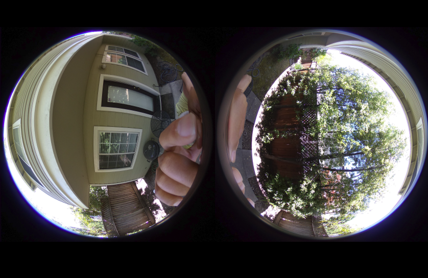

# theta4j Fisheye
Uses theta4j library to take dual-fisheye images that
retain metadata.

## Preserve Metadata
    
    ExifTool Version Number         : 10.80
    File Name                       : R0010015.JPG
    Directory                       : .
    File Size                       : 4.6 MB
    File Modification Date/Time     : 2019:06:11 13:04:04-07:00
    File Access Date/Time           : 2019:06:11 13:06:03-07:00
    File Inode Change Date/Time     : 2019:06:11 13:06:01-07:00
    File Permissions                : rw-r--r--
    File Type                       : JPEG
    File Type Extension             : jpg
    MIME Type                       : image/jpeg
    Exif Byte Order                 : Big-endian (Motorola, MM)
    Image Description               : 
    Make                            : RICOH
    Camera Model Name               : RICOH THETA V
    Orientation                     : Horizontal (normal)
    X Resolution                    : 300
    Y Resolution                    : 300
    Resolution Unit                 : inches
    Software                        : RICOH THETA V Ver 3.00.1
    Modify Date                     : 2019:06:11 13:04:03
    Y Cb Cr Positioning             : Centered
    Copyright                       : 
    Exposure Time                   : 1/200
    F Number                        : 2.0
    Exposure Program                : Program AE
    ISO                             : 80
    Sensitivity Type                : Standard Output Sensitivity
    Exif Version                    : 0230
    Date/Time Original              : 2019:06:11 13:04:03
    Create Date                     : 2019:06:11 13:04:03
    Components Configuration        : Y, Cb, Cr, -
    Aperture Value                  : 2.0
    Brightness Value                : 4.91
    Exposure Compensation           : 0
    Max Aperture Value              : 2.1
    Metering Mode                   : Multi-segment
    Light Source                    : Unknown
    Flash                           : No flash function
    Focal Length                    : 2.6 mm
    Warning                         : [minor] Possibly incorrect maker notes offsets (fix by -84?)
    Maker Note Type                 : Rdc
    Firmware Version                : 3.01
    Serial Number                   : (00000000)00105377
    Recording Format                : Unknown (0)
    White Balance                   : Auto
    Color Temp Kelvin               : 5000
    Accelerometer                   : 2.72 9.3
    Compass                         : 339.49
    Time Zone                       : -07:00
    Flashpix Version                : 0100
    Color Space                     : sRGB
    Exif Image Width                : 5792
    Exif Image Height               : 2896
    Interoperability Index          : R98 - DCF basic file (sRGB)
    Interoperability Version        : 0100
    Exposure Mode                   : Auto
    Scene Capture Type              : Standard
    Sharpness                       : Normal
    GPS Version ID                  : 2.3.0.0
    GPS Img Direction Ref           : Magnetic North
    GPS Img Direction               : 339.49
    Compression                     : JPEG (old-style)
    Thumbnail Offset                : 2448
    Thumbnail Length                : 12770
    Image Width                     : 5792
    Image Height                    : 2896
    Encoding Process                : Baseline DCT, Huffman coding
    Bits Per Sample                 : 8
    Color Components                : 3
    Y Cb Cr Sub Sampling            : YCbCr4:2:0 (2 2)
    Aperture                        : 2.0
    Image Size                      : 5792x2896
    Megapixels                      : 16.8
    Ricoh Pitch                     : 9.3
    Ricoh Roll                      : 2.72
    Shutter Speed                   : 1/200
    Thumbnail Image                 : (Binary data 12770 bytes, use -b option to extract)
    Focal Length                    : 2.6 mm
    Light Value                     : 10.0
